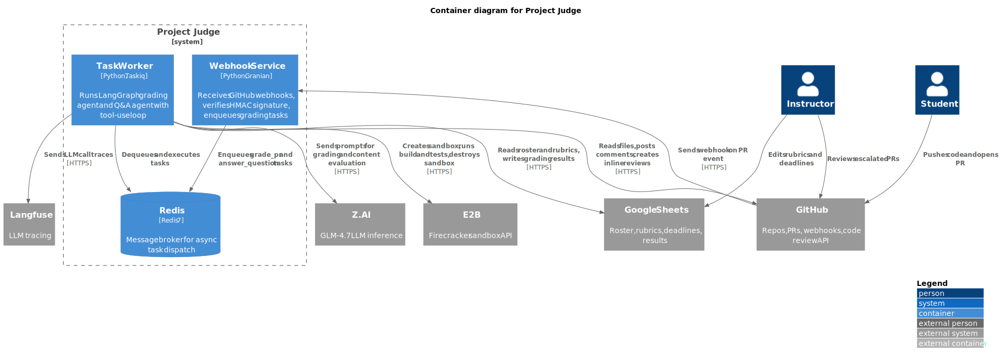

# MAS для автоматической проверки студенческих проектов

## Что за задача и какая боль сейчас

Преподаватель курса тратит **20-30 минут на ручную проверку одного PR** от студента: проверить наличие артефактов, оценить качество документов по рубрикам, посчитать штрафы за просрочку, оставить развёрнутый комментарий. При потоке 30-40 студентов на 7 лабораторных — это сотни часов рутины за семестр.

При этом обратная связь неравномерная: первые PR получают детальный разбор, последние — беглый. Студенты не видят себя в контексте группы и не понимают как улучшиться.

## Что делает система

Агентная система автоматически обрабатывает PR студента в GitHub Classroom:

- **Проверяет наличие артефактов** по спецификации лабораторной
- **Парсит DoD чеклист** из описания PR
- **Оценивает качество документов** по рубрикам через LLM
- **Проверяет код в sandbox (E2B)** — суб-агент с tool-use loop: изучает структуру, запускает сборку, тесты, оценивает качество кода на уровне junior
- **Оставляет inline review comments** на конкретных строках кода в PR
- **Считает штрафы за дедлайн** по дате открытия PR
- **Публикует детальный отчёт** в PR с оценкой по каждому критерию
- **Поддерживает перепроверку** — студент пишет комментарий, Q&A агент запускает recheck
- **Отвечает на вопросы студентов** в PR (наводящие подсказки, не готовые ответы)
- **Эскалирует** спорные случаи преподавателю (label `needs-review`)
- **Обновляет лидерборд** в Google Sheets

## Архитектура



**Tool-use loop agent** — агент сам решает какие инструменты вызвать и в каком порядке. 12 tools для грейдинга, 4 для Q&A.

### Диаграммы

| Диаграмма | Описание |
|-----------|----------|
| [C4 Context](docs/diagrams/c4-context.svg) | Система, пользователи, внешние сервисы |
| [C4 Container](docs/diagrams/c4-container.svg) | Webhook, worker, agent, sub-agents, Redis |
| [C4 Component](docs/diagrams/c4-component.svg) | Внутреннее устройство agent core (12 tools) |
| [Workflow](docs/diagrams/workflow.svg) | Полный execution flow с ветками ошибок |
| [Data Flow](docs/diagrams/data-flow.svg) | Как данные проходят через систему |

Подробнее: [docs/system-design.md](docs/system-design.md)

### Architecture Metrics

> Validated with [aact](https://github.com/ChS23/aact) — Architecture As Code Tools

| Metric | Value |
|--------|-------|
| Elements | 10 |
| Sync API calls | 9 |
| Databases | 1 |
| Boundary cohesion | 2 internal / 5 external |
| Rules passed | acyclic, cohesion, stableDependencies, commonReuse |
| Violations | 0 |

```bash
cd docs/diagrams && pnpx aact check    # validate
cd docs/diagrams && pnpx aact analyze  # metrics
```

## Tech Stack

- **Python 3.13**, LangGraph, Pydantic
- **LLM**: GLM-4.7 via Z.AI API (OpenAI-compatible)
- **Sandbox**: E2B (Firecracker microVM)
- **GitHub App**: gidgethub + httpx
- **Google Sheets**: aiogoogle
- **Task queue**: Taskiq + Redis
- **Server**: Granian (ASGI)
- **Observability**: Langfuse + structlog
- **Deploy**: Docker Compose

## Запуск

```bash
# 1. Настроить переменные окружения
cp .env.example .env
# Заполнить: GITHUB_APP_ID, GITHUB_PRIVATE_KEY_PATH, GITHUB_WEBHOOK_SECRET,
#            ZAI_API_KEY, E2B_API_KEY, GOOGLE_SERVICE_ACCOUNT_JSON, etc.

# 2. Запустить
docker compose up -d

# 3. Для разработки (Redis port exposed)
docker compose -f compose.dev.yml up -d

# 4. Для туннеля (ngrok/cloudflared)
docker compose -f compose.host.yml up -d
```

## Документация

| Документ | Описание |
|----------|----------|
| [system-design.md](docs/system-design.md) | Архитектура, workflow, failure modes, constraints |
| [diagrams/](docs/diagrams/) | C4 диаграммы и flow diagrams (PlantUML) |
| [specs/](docs/specs/) | Спецификации модулей: agent, tools, memory, serving, observability |
| [grading-rules.md](docs/grading-rules.md) | Правила оценки, формат отчёта, эскалация |
| [governance.md](docs/governance.md) | Риски, injection defense, data handling |
| [data-sources.md](docs/data-sources.md) | Google Sheets schema, источники данных |
| [product-proposal.md](docs/product-proposal.md) | Цели, метрики, edge cases |

## Что НЕ делает (out-of-scope)

- Не проверяет плагиат между студентами
- Не оценивает бизнес-валидность идеи проекта
- Не интегрируется с LMS (Moodle, Canvas)
- Никогда не мёрджит PR и не модифицирует репозитории студентов
